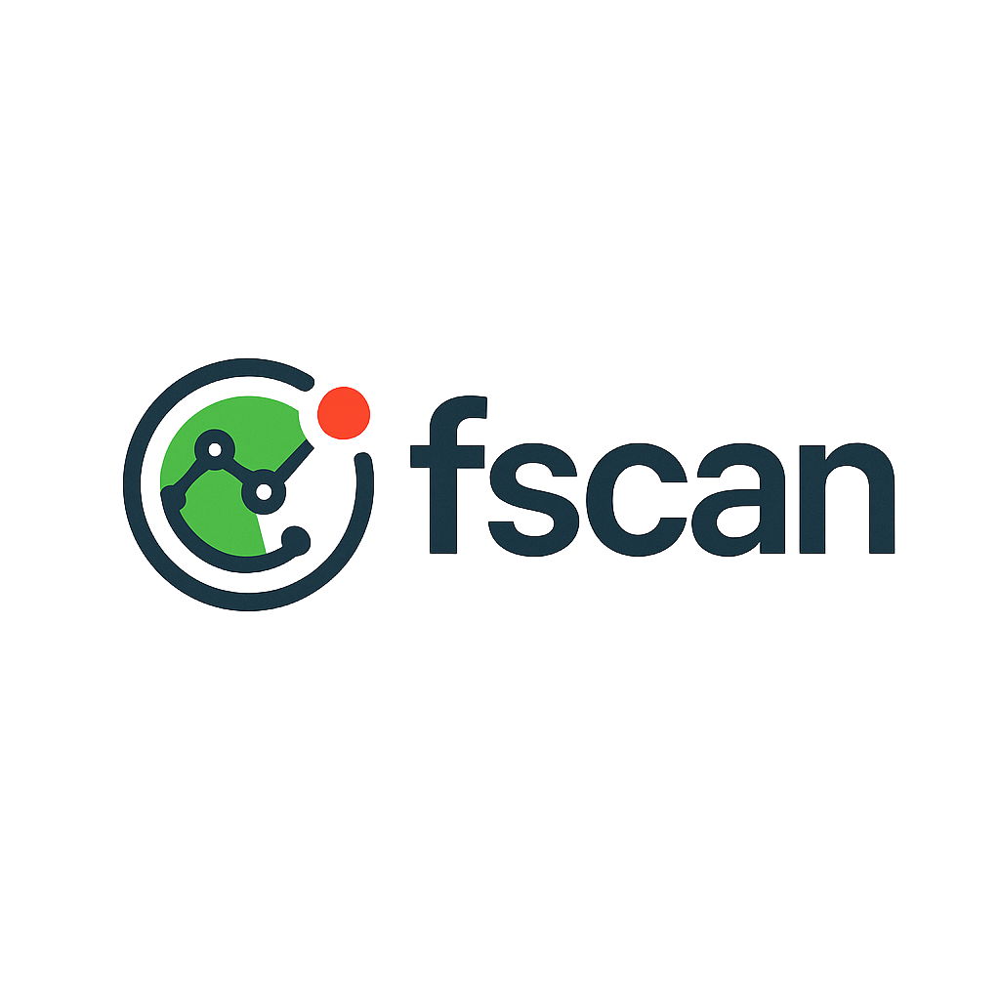

# FScan

<div align="center">      <br><br>
</a><a href="#"></a><a href="#"></a></a><a href="#"></a></div>


## 简介

FScan是一款内网扫描工具，旨在辅助安全从业人员进行内网安全评估工作。

完整功能介绍、使用说明及最新更新请访问我们的官方网站。

## 官方网站

**https://fscan.club/**

访问官网获取:

- 详细功能文档
- 使用教程
- 最新版本下载
- 常见问题解答
- 技术支持

## 编译说明

```bash
# 基础编译
go build -ldflags="-s -w" -trimpath main.go

# UPX压缩（可选）
upx -9 fscan
```

## 安全声明

<div style="background-color: #f8d7da; padding: 15px; border-radius: 5px; border-left: 5px solid #842029;"> <b>重要提示</b><br> 本工具仅面向<b>合法授权</b>的企业安全建设行为。使用本工具进行检测时，您应确保该行为符合当地的法律法规，并且已经取得了足够的授权。<b>请勿对非授权目标进行扫描。</b>

如您在使用本工具的过程中存在任何非法行为，您需自行承担相应后果，我们将不承担任何法律及连带责任。

在安装并使用本工具前，请您<b>务必审慎阅读、充分理解各条款内容</b>。除非您已充分阅读、完全理解并接受本协议所有条款，否则，请您不要安装并使用本工具。您的使用行为即视为您已阅读并同意本协议的约束。

## 404StarLink 2.0 - Galaxy


fscan 是 404Team [星链计划2.0](https://github.com/knownsec/404StarLink2.0-Galaxy) 中的一环，如果对fscan 有任何疑问又或是想要找小伙伴交流，可以参考星链计划的加群方式。

- [https://github.com/knownsec/404StarLink2.0-Galaxy#community](https://github.com/knownsec/404StarLink2.0-Galaxy#community)

演示视频[【安全工具】5大功能，一键化内网扫描神器——404星链计划fscan](https://www.bilibili.com/video/BV1Cv4y1R72M)

## Star Chart
[](https://starchart.cc/shadow1ng/fscan)

## 捐赠
 如果你觉得这个项目对你有帮助，你可以请作者喝饮料🍹 [点我](image/sponsor.png)

## 参考链接

https://github.com/Adminisme/ServerScan  
https://github.com/netxfly/x-crack  
https://github.com/hack2fun/Gscan  
https://github.com/k8gege/LadonGo   
https://github.com/jjf012/gopoc

## 广告位：安全培训


学网络安全，就选玲珑安全！专业漏洞挖掘，精准定位风险；助力技能提升，塑造安全精英;玲珑安全，为您的数字世界保驾护航！  
在线免费学习网络安全，涵盖src漏洞挖掘，0基础安全入门。适用于小白，进阶，高手: https://space.bilibili.com/602205041  
玲珑安全往期学员报喜🎉: https://www.ifhsec.com/list.html  
玲珑安全漏洞挖掘培训学习联系微信: linglongsec

<div align="center">   <a href="https://fscan.club"></a>&nbsp;&nbsp;   <a href="#"></a>&nbsp;&nbsp;   </div> <br> <div align="center">   <b>FScan</b> - 为后渗透提供支持   <br>   <small>Copyright © 2025 FScan Team</small> </div>
