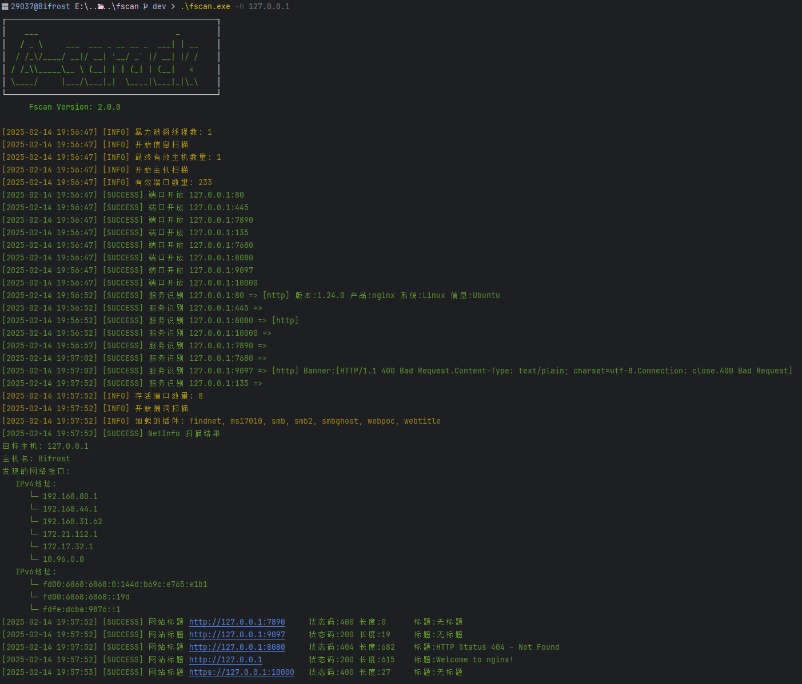
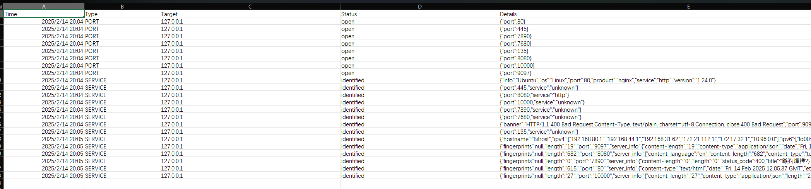

# Fscan 
[English][url-docen]

# 0x01 简介

一款内网综合扫描工具，方便一键自动化、全方位漏扫扫描。

# 0x02 主要功能
## 1. 信息搜集
- 基于ICMP的主机存活探测：快速识别网络中的活跃主机设备
- 全面的端口扫描：系统地检测目标主机的开放端口情况

## 2. 爆破功能
- 常用服务密码爆破：支持SSH、SMB、RDP等多种协议的身份认证测试
- 数据库密码爆破：覆盖MySQL、MSSQL、Redis、PostgreSQL、Oracle等主流数据库系统

## 3. 系统信息与漏洞扫描
- 网络信息收集：包括NetBIOS探测和域控制器识别
- 系统信息获取：能够读取目标系统网卡配置信息
- 安全漏洞检测：支持MS17-010等高危漏洞的识别与检测

## 4. Web应用探测
- 网站信息收集：自动获取网站标题信息
- Web指纹识别：可识别常见CMS系统与OA框架
- 漏洞扫描能力：集成WebLogic、Struts2等漏洞检测，兼容XRay POC

## 5. 漏洞利用模块
- Redis利用：支持写入公钥或植入计划任务
- SSH远程执行：提供SSH命令执行功能
- MS17-010利用：支持ShellCode注入，可实现添加用户等操作

## 6. 辅助功能
- 扫描结果存储：将所有检测结果保存至文件，便于后续分析

# 0x03 使用说明
完整功能介绍、使用说明及最新更新请访问我们的官方网站。

## 官方网站

**https://fscan.club/**

访问官网获取:

- 详细功能文档
- 使用教程
- 最新版本下载
- 常见问题解答
- 技术支持

## 编译说明

```bash
# 基础编译
go build -ldflags="-s -w" -trimpath main.go

# UPX压缩（可选）
upx -9 fscan
```

## 系统安装
```bash
# Arch Linux
yay -S fscan-git
# 或
paru -S fscan-git
```

# 0x04 运行截图

`fscan.exe -h 192.168.x.x  (全功能、ms17010、读取网卡信息)`


`fscan.exe -h 192.168.x.x -rf id_rsa.pub (redis 写公钥)`


`fscan.exe -h 192.168.x.x -c "whoami;id" (ssh 命令)`


`fscan.exe -h 192.168.x.x -p80 -proxy http://127.0.0.1:8080 一键支持xray的poc`


`fscan.exe -h 192.168.x.x -p 139 (netbios探测、域控识别,下图的[+]DC代表域控)`


`go run .\main.go -h 192.168.x.x/24 -m netbios(-m netbios时,才会显示完整的netbios信息)`


`go run .\main.go -h 192.0.0.0/8 -m icmp(探测每个C段的网关和数个随机IP,并统计top 10 B、C段存活数量)`


新的展示





# 0x05 免责声明

本工具仅面向**合法授权**的企业安全建设行为，如您需要测试本工具的可用性，请自行搭建靶机环境。

为避免被恶意使用，本项目所有收录的poc均为漏洞的理论判断，不存在漏洞利用过程，不会对目标发起真实攻击和漏洞利用。

在使用本工具进行检测时，您应确保该行为符合当地的法律法规，并且已经取得了足够的授权。**请勿对非授权目标进行扫描。**

如您在使用本工具的过程中存在任何非法行为，您需自行承担相应后果，我们将不承担任何法律及连带责任。

在安装并使用本工具前，请您**务必审慎阅读、充分理解各条款内容**，限制、免责条款或者其他涉及您重大权益的条款可能会以加粗、加下划线等形式提示您重点注意。

除非您已充分阅读、完全理解并接受本协议所有条款，否则，请您不要安装并使用本工具。您的使用行为或者您以其他任何明示或者默示方式表示接受本协议的，即视为您已阅读并同意本协议的约束。


# 0x06 404StarLink 2.0 - Galaxy


fscan 是 404Team [星链计划2.0](https://github.com/knownsec/404StarLink2.0-Galaxy) 中的一环，如果对fscan 有任何疑问又或是想要找小伙伴交流，可以参考星链计划的加群方式。

- [https://github.com/knownsec/404StarLink2.0-Galaxy#community](https://github.com/knownsec/404StarLink2.0-Galaxy#community)

演示视频[【安全工具】5大功能，一键化内网扫描神器——404星链计划fscan](https://www.bilibili.com/video/BV1Cv4y1R72M)
# 0x07 Star Chart
[](https://starchart.cc/shadow1ng/fscan)

# 0x08 捐赠
 如果你觉得这个项目对你有帮助，你可以请作者喝饮料🍹 [点我](image/sponsor.png)

# 0x09  安全培训

学网络安全，就选玲珑安全！专业漏洞挖掘，精准定位风险；助力技能提升，塑造安全精英;玲珑安全，为您的数字世界保驾护航！  
在线免费学习网络安全，涵盖src漏洞挖掘，0基础安全入门。适用于小白，进阶，高手: https://space.bilibili.com/602205041  
玲珑安全往期学员报喜🎉: https://www.ifhsec.com/list.html  
玲珑安全漏洞挖掘培训学习联系微信: linglongsec

# 0x10 参考链接
https://github.com/Adminisme/ServerScan  
https://github.com/netxfly/x-crack  
https://github.com/hack2fun/Gscan  
https://github.com/k8gege/LadonGo   
https://github.com/jjf012/gopoc

[url-docen]: README_EN.md
